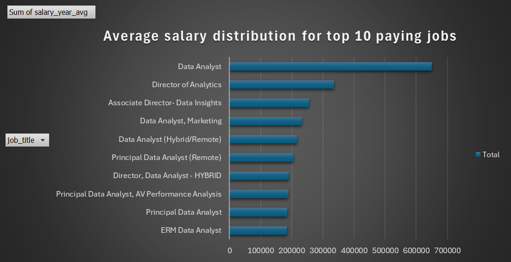
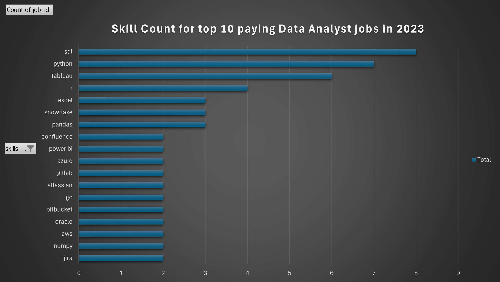
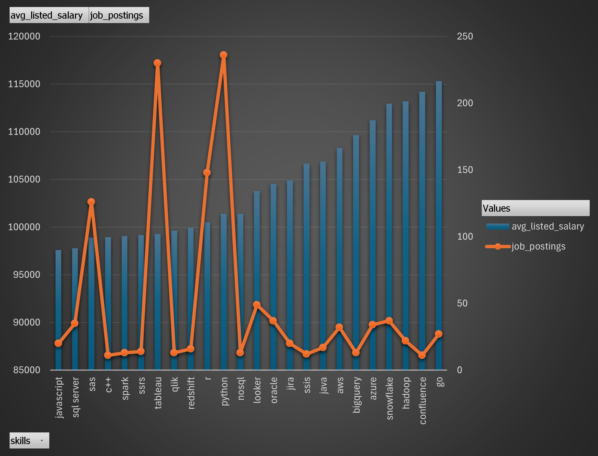

# Introduction
In this project, I conducted an in-depth analysis of the data job market, examining top-paying positions, in-demand skills, and the intersection of high demand and high salaries within data analytics. As an aspiring data analyst, I specifically concentrated on queries related to the role of a data analyst.

My SQL queries can be found here: [sql_capstone_project](/sql_capstone_project/)

# Background

Motivated to explore a new field and immerse myself in data analytics, I embarked on this project as part of a SQL course led by Luke Barousse. 

All data is from this [SQL Course](https://www.lukebarousse.com/sql).

### The questions I am looking to answer through my SQL queries are: 

1. What are the top paying data analyst jobs?
2. What skills are required for these top paying jobs?
3. What skills are most in demand for a data analyst?
4. Which skills are associated with higher salaries?
5. What are the most optimal skills to learn?

# Tools I Used

For this project, i utilised the following tools: 

- **SQL**: The backbone of this project. It allows me to query the database and help me find insights in the data.
- **PostgreSQL**: The chosen database management tool. 
- **Visual Studio Code**: Allows me to write and test my queries agaisnt the database.
- **Git & GitHub**: Allows me to version control and share my SQL scripts. 
- **Excel**: Chosen data visualisation tool.

# The Analysis

Each query I worked on in this project was designed to investigate specific aspects of the data analyst job market. Here is how I approached each question:

### 1. Top Paying Data Analyst Roles

To identify the highest-paying roles, I filtered data analyst positions by average annual salary and location, specifically focusing on remote jobs. This query highlights the lucrative opportunities available in the field.

```sql
SELECT
    job_id,
    job_title,
    job_location,
    job_schedule_type,
    salary_year_avg,
    job_posted_date,
    name AS company_name
FROM
    job_postings_fact jpf
LEFT JOIN company_dim cd ON jpf.company_id = cd.company_id
WHERE
    job_title_short = 'Data Analyst' AND
    job_location = 'Anywhere' AND
    salary_year_avg IS NOT NULL
ORDER BY
    salary_year_avg DESC
LIMIT 10;
```
[Raw results of the above query](sql_project/3_CSVs/1_top_jobs_by_pay.csv)

Here is a breakdown of the top data analyst jobs in 2023:

1. **Wide Salary Range:** The top 10 highest-paying data analyst roles offer salaries ranging from $184,000 to $650,000, indicating significant earning potential in the field.

2. **Diverse Employers:** Companies such as SmartAsset, Meta, and AT&T are among those offering high salaries, demonstrating a broad interest across various industries.

3. **Job Title Variety:** There is a wide range of job titles, from Data Analyst to Director of Analytics, reflecting the varied roles and specialisations within data analytics.


*Bar graph visualising the salary for the top 10 salaries for data analysts.*

### 2. Skills for Top Paying Jobs

To determine the skills required for the top-paying jobs, I combined the job postings with skills data. This provided valuable insights into the qualifications that employers prioritise for high-compensation roles.

```sql
WITH top_paid_jobs AS (
    SELECT
        jpf.job_id,
        jpf.job_schedule_type,
        jpf.salary_year_avg,
        cd.name AS company_name
    FROM
        job_postings_fact jpf
    LEFT JOIN company_dim cd ON jpf.company_id = cd.company_id
    WHERE
        jpf.job_title_short = 'Data Analyst' AND
        jpf.job_location = 'Anywhere' AND
        jpf.salary_year_avg IS NOT NULL
    ORDER BY
        salary_year_avg DESC
    LIMIT 10
)

SELECT 
    tpj.*,
    sd.skills
FROM
    top_paid_jobs tpj
INNER JOIN skills_job_dim sjd ON tpj.job_id = sjd.job_id
INNER JOIN skills_dim sd ON sjd.skill_id = sd.skill_id
ORDER BY
    salary_year_avg DESC;
```
Here is a breakdown of the most demanded skills for the top 10 highest-paying data analyst jobs:
- SQL is top with a count of 8.
- Python comes in 2nd with a count of 7.
- other skills like Tableau, R, Snowflake and Excel show varying degrees of demand


*Bar graph visualising the count of skills for the top 10 paying jobs for data analysts*

### 3. In-Demand Skills for Data Analysts

This query was used to identify the skills most frequently requested in job postings, highlighting areas with the highest demand.

```sql
SELECT
    skills,
    COUNT(sjd.job_id) as demand_count
FROM job_postings_fact jpf
INNER JOIN skills_job_dim sjd ON jpf.job_id = sjd.job_id
INNER JOIN skills_dim sd ON sjd.skill_id = sd.skill_id
WHERE
    job_title_short = 'Data Analyst'
    --AND job_work_from_home = True
GROUP BY
    skills
ORDER BY
    demand_count DESC
LIMIT 5;
```
Here is the breakdown of the most demanded skills for data analysts.

- SQL and Excel remain fundamental, underscoring the necessity of strong foundational skills in data processing and spreadsheet manipulation.
- Programming and visualisation tools such as Python, Tableau, and Power BI are essential, highlighting the growing importance of technical skills in data storytelling and decision support.
- The skills in demand for both onsite and remote positions remain consistent. 

| skills   | demand_count |
|----------|--------------|
| sql      | 92628        |
| excel    | 67031        |
| python   | 57326        |
| tableau  | 46554        |
| power bi | 39468        |

*Results without filtering by 'job_work_from_home'.*

| skills   | demand_count |
|----------|--------------|
| sql      | 7291         |
| excel    | 4611         |
| python   | 4330         |
| tableau  | 3745         |
| power bi | 2609         |

*Results filtered by 'job_work_from_home'*

### 4. Skills Based on Salary

Exploring the average salaries associated with different skills revealed which skills command the highest pay.

```sql
SELECT
    skills,
    ROUND(AVG(salary_year_avg),2) AS avg_salary
FROM job_postings_fact jpf
INNER JOIN skills_job_dim sjd ON jpf.job_id = sjd.job_id
INNER JOIN skills_dim sd ON sjd.skill_id = sd.skill_id
WHERE
    job_title_short = 'Data Analyst'
    AND salary_year_avg IS NOT NULL
    AND job_work_from_home = True
GROUP BY
    skills
ORDER BY
    avg_salary DESC
LIMIT 25;
```

Here is the breakdown of top paying skills for Data Analysts:

- **High Demand for Big Data and Machine Learning Skills**: Top salaries are commanded by analysts proficient in big data technologies such as PySpark and Couchbase, machine learning tools like DataRobot and Jupyter, and Python libraries such as Pandas and NumPy. This reflects the industry's high valuation of data processing and predictive modelling capabilities.
- **Software Development and Deployment Proficiency**: Knowledge in development and deployment tools like GitLab, Kubernetes, and Airflow indicates a lucrative crossover between data analysis and engineering. There is a premium on skills that facilitate automation and efficient data pipeline management.
- **Cloud Computing Expertise**: Familiarity with cloud and data engineering tools such as Elasticsearch, Databricks, and Google Cloud Platform (GCP) underscores the growing importance of cloud-based analytics environments. This suggests that cloud proficiency significantly boosts earning potential in data analytics.

| skills         | avg_salary |
|----------------|------------|
| pyspark        | 208172.25  |
| bitbucket      | 189154.5   |
| couchbase      | 160515     |
| watson         | 160515     |
| datarobot      | 155485.5   |
| gitlab         | 154500     |
| swift          | 153750     |
| jupyter        | 152776.5   |
| pandas         | 151821.33  |
| elasticsearch  | 145000     |
| golang         | 145000     |

*Table of the average salary for the top 10 paying skills for a data analyst.*

### 5. Most Optimal Skills to Learn

Combining insights from demand and salary data, this query aimed to pinpoint skills that are both in high demand and command high salaries, providing a strategic focus for skill development.

```sql
SELECT
    sd.skill_id,
    sd.skills,
    COUNT(sjd.job_id) AS demand_count,
    ROUND(AVG(jpf.salary_year_avg), 0) AS avg_salary
FROM
    job_postings_fact jpf
INNER JOIN skills_job_dim sjd ON jpf.job_id = sjd.job_id
INNER JOIN skills_dim sd ON sjd.skill_id = sd.skill_id
WHERE
    jpf.job_title_short = 'Data Analyst'
    AND jpf.salary_year_avg IS NOT NULL
    AND jpf.job_work_from_home = TRUE
GROUP BY
    sd.skill_id,
HAVING
    COUNT(sjd.job_id) > 10
ORDER BY
    avg_salary DESC,
    demand_count DESC
LIMIT
    25;
```
[Raw results of the above query](sql_project/3_CSVs/5_optimal_skills.csv)



*Bar graph visualising the optimal skills for a data analyst.*

Here is a breakdown of the most optimal skills for Data Analysts:
- **High-Demand Programming Languages**: Python and R are particularly prominent, with demand counts of 236 and 148, respectively. The average salaries are approximately $101,397 for Python and $100,499 for R, indicating that while proficiency in these languages is highly valued, it is also widely available.
- **Cloud Tools and Technologies**: Expertise in specialized technologies such as Snowflake, Azure, AWS, and BigQuery shows significant demand with relatively high average salaries. This trend underscores the growing importance of cloud platforms and big data technologies in data analysis.
- **Business Intelligence and Visualisation Tools**: Tableau and Looker, with demand counts of 230 and 49, respectively, and average salaries of around $99,288 and $103,795, highlight the critical role of data visualisation and business intelligence in deriving actionable insights from data.
- **Database Technologies**: The demand for skills in traditional and NoSQL databases (such as Oracle, SQL Server, and NoSQL) with average salaries ranging from $97,786 to $104,534 reflects the enduring need for expertise in data storage, retrieval, and management.

# What i learned

This project marks my first deep dive into a data analytics project, allowing me to put my SQL knowledge into practice and significantly enhance my skill set with the following:
- **Complex Query Crafting**: Gained experience in advanced SQL, merging tables and utilsing WITH clauses to generate temp tables. 
- **Data Aggregation**: Used GROUP BY and aggregate functions like COUNT() and AVG(). 
- **Analytical Skills**: Upgraded my skills set by applying it to a real world problem and turning questions into actionable SQL queries.

# Conclusions

From the analysis, several general insights emerged:

**Top-Paying Data Analyst Jobs**: The highest-paying remote data analyst jobs offer a wide range of salaries, with the top salary reaching $650,000.

**Skills for Top-Paying Jobs**: High-paying data analyst roles require advanced proficiency in SQL, indicating it is a critical skill for achieving a top salary.

**Most In-Demand Skills**: SQL is the most demanded skill in the data analyst job market, making it essential for job seekers.

**Skills with Higher Salaries**: Specialized skills, such as SVN and Solidity, are associated with the highest average salaries, indicating a premium on niche expertise.

**Optimal Skills for Job Market Value**: SQL not only leads in demand but also offers a high average salary, positioning it as one of the most optimal skills for data analysts to learn to maximize their market value.

### Closing Thoughts

This project significantly enhanced my SQL skills and provided valuable insights into the data analyst job market. This project has demonstrated how my skills can be applied to solving real-world problems while highlighting the need for continuous improvement for both aspiring data analysts like myself and those already in the field. This ongoing skill development is essential for accessing higher-paid jobs in the field.
